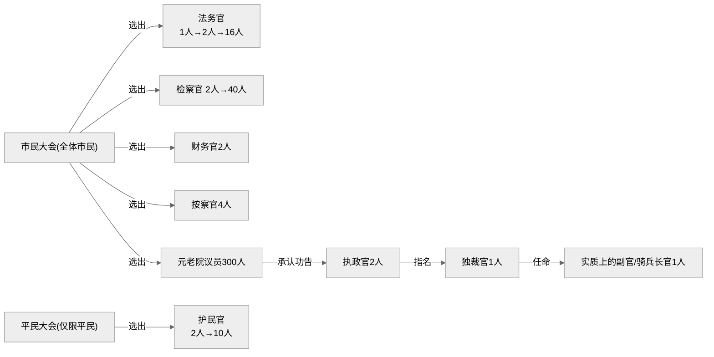

时间线上，第一本书讲述的是公元前 753 年至公元前 270 年间罗马的历史，在这 500 年间罗马完成了从建国到统一意大利（北至卢比孔河，南至墨西拿海峡）。

我最感兴趣的还是这一时期罗马政治制度由王政向共和演变部分的内容：

## 王政时期

罗马在建立之初，虽是王政体制，没有世袭制，重视法律，且已具备民主雏形，通过不断地征服和赋予被征服者公民权利，吸纳新鲜血液。
宗教上，自然状态下的政教分离，世俗化的宗教信仰。

### 罗穆路斯

这一天是公元前753年的4月21日。就这样，作为罗马建国纪念日，这一天在随后一千多年的漫长岁月里，成了每年必不可少的一个节日。
这一年，罗穆路斯18岁。通过这位年轻人和追随他的3000名拉丁人的努力，罗马建立了国家。

罗马建国后，作为第一代国王，罗穆路斯并没有独揽大权，他把国政分成三个机构，分别是**国王、元老院和市民大会**，并由这三方共同治理罗马。
作为宗教祭祀、军事和政治的最高领导人，国王由市民大会投票选举产生。曾经是羊倌和农民领袖的罗穆路斯本人一定认为自己这个王不是自封的，而是经过市民大会选举的。**国王由市民大会选举产生的这种制度，不是君主政体，却是当时的罗马最为自然的选择。**
罗穆路斯设立了元老院。他召集100位长老参加元老院。我不清楚为什么元老院的人数是100人。我猜想也许是当时把各门第的长老全部召集起来后，一共就这么多吧。**元老院议员不是政府官职，他们的职责是向国王提出忠告和建议，所以不需要通过市民大会的选举。**
**市民大会由全体罗马市民组成。它的任务是选出以国王为首的各级政府官员。市民大会没有制定政策的权力，但是对国王听取元老院的建议后制定出来的政策有赞成或反对的表决权。此外，在对外关系上，是战是和，也必须征得他们的同意才可实施。**
这就是罗马建国之初的国家基本形态。它一方面符合当时的罗马国情，同时它也是一种可能适用于将来的、简单而完美的、非常行之有效的政体。

罗穆路斯向萨宾人提出了一个和平建议。不是建议在相互尊重的基础上和平共处，而是建议两个部族合并起来。这个建议实际上是要萨宾人放弃自己的领地，移居到罗马。而七个山丘之一的奎里尔诺山被提供给他们作为新的居处。
两个部族合并后，**萨宾全体自由人享有和罗马人完全相同的市民权利。在保证他们有关私有财产的种种权利的同时，他们也享有在市民大会上的投票权。而且，罗穆路斯还为萨宾长老提供了在元老院的席位。**

### 努马

但是第二代罗马国王努马的功绩中，最值得大书特书的是有关宗教的改革。
努马为诸神设立了等级制度，但是没有规定哪些是罗马之神。目的是要让大家懂得尊重诸神的重要性。

以希腊、罗马为代表的多神教和以犹太教、基督教为典型的一神教的不同之处在于，多神教从不祈求诸神来纠正人类的行为道德，而这正是一神教中的神的专利特权。在希腊神话中我们会发现，多神教中的诸神有着和人类相同的缺点。既然他们的职责不是纠正人类的道德行为，有缺点自然无大碍。但是一神教的神不能有一丝一毫的缺点，因为它的职责是纠正人类的道德行为。

那么，罗马人既然不祈求诸神纠正自己的道德伦理，他们祈求的又是什么呢？是保护神。

我们看罗马宗教，可以发现一个与其他民族很不一样的特点，罗马没有专职神官。罗马不设脱离凡尘俗世而只做神和人的纽带的神官。

在罗马，宗教和政治之间不会出现明争暗斗或相互利用的情形。自然状态下的政教分离也许是努马最重要的一个功绩。

**向宗教寻求纠正人类行为准则的是犹太人。**

**向哲学寻求纠正人类行为准则的是希腊人。**

**向法律寻求纠正人类行为准则的是罗马人。**

### 塔克文·普里斯库斯

那时，几乎所有人都知道，只要愿意在罗马定居，就可以拥有市民权。而且，像努马和安库斯那样，尽管不是建国者拉丁人，却也坐上了罗马国王的宝座。想必正是这一点，对塔克文很有吸引力吧。于是，他决定带着一家老小，带着全部家产，投奔罗马而来。

然而塔克文并不满足于当一个公证人。在国王死后，他毛遂自荐要竞选罗马国王。大概他是开展选举活动的第一个罗马人。

### 塞尔维乌斯

塞尔维乌斯·图里乌斯成就的功绩中，最重要的莫过于军队体制的改革。他所进行的这一改革不仅涉及税制改革，而且涉及选举制度的改革。

作为一个国民，他所承担的义务一是缴纳税金，二是保家卫国。在古代，很多国家都以服兵役的形式来抵直接税，罗马如此，希腊也一样。只有做到这一点，他才是独立的市民。作为独立的市民，自然会有相应的权利。市民的权利就是投票权。**所以军队体制等于税制，也等于选举制，这一等式成立，并且天衣无缝。**

在开始这一改革前，塞尔维乌斯首先在罗马进行了最早的一次人口普查。他的主要目的是了解罗马的战斗力。我们无法从这次人口调查中得知罗马当时的总人口，我们只知道塞尔维乌斯依据调查得出的市民数和各自的财力，制定了新的制度。

**根据这一新制度，罗马市民不再以贵族和平民区分，而是依据拥有的财力分为六个阶级。**列表如下：

| 阶级   | 财产（单位：阿斯）      | 军制（单位：百人队）                          | 票数 |
|------|----------------|-------------------------------------|----|
| 第一阶级 | 100000以上       | 骑兵 18 步兵 80                      | 98 |
| 第二阶级 | 75000 — 100000 | 步兵 20                               | 20 |
| 第三阶级 | 50000 — 75000  | 步兵 20                               | 20 |
| 第四阶级 | 25000 — 50000  | 步兵 20                               | 20 |
| 第五阶级 | 12500 — 25000  | 步兵 30                               | 30 |
| 无产阶级 | 所谓财产只有子女       | 步兵 5 （预备役） | 5  |

罗马选举制实行的不是一人一票制，而是按军团的最小单位，每百人队一票。百人队中的100个人首先要在内部进行讨论，形成的统一意见就体现在这一票上。其实，它相当于小的选举区制。希腊雅典的选举采用的是一人一票制，而罗马一直坚持百人一票的投票方式。

仅仅第一阶级，票数就已经过半了。的确如此。在公元前6世纪的罗马，**人们普遍认同谁承担更多的义务，谁理所当然享有更多的权利。** 不承担义务的人，也就是免除相当于直接税的军务的人是那些不满16岁的未成年男子和已经完成多年军务的60岁以上的老人、女人、奴隶及无产者，即除了孩子没有任何财产的人。

### 傲慢者塔克文

傲慢者塔克文是塔克文·普里斯库斯的孙子。

罗马第七代国王塔克文禁止为先王塞尔维乌斯举行葬礼。不仅如此，他还对他认为是先王指派的元老院议员大开杀戒。他继承王位没有经过市民大会的选举，也没有元老院的同意，因此，没有全副武装的卫兵保护，他绝不走出宫门一步。从他登基到被逐出罗马，他从来没有向元老院征求过任何意见或建议，也从来不问市民大会同意与否。市民们在背后称他为“傲慢者塔克文”。

布鲁特斯向市民们作了演讲。他说，我们绝不能让贞洁的、行为端正的女人们再次成为这种兽性的牺牲品。他让在场的人们想起了国王塔克文是如何杀害先王夺取王位的。他向市民提议把国王和他的家人统统逐出罗马。一直以来藏在罗马人心中的对塔克文的不满爆发了。对布鲁特斯的提议，民众大声表示赞同，并积极响应布鲁特斯召集市民参军的号召。

“傲慢者塔克文”的统治持续了25年。随着第七代国王塔克文的统治的结束，罗马的王政时代也告结束。时间是公元前509年。**从罗穆路斯于公元前753年建国到这一年，罗马已经走过了244年。随后的罗马进入了共和政体，迎来了执政官统治的时代。和从前一样，执政官也由市民大会选举产生，任期由终身改为短短的一年，还有，原来由一位国王统治改为由两位执政官共同治理。**

## 共和政体

巧妙利用丑闻推翻王政的最大功臣是路奇乌斯·尤尼乌斯·布鲁特斯。他是随后延续了500年的共和制罗马的创始人。

布鲁特斯把国王逐出罗马后，马上召集市民到古罗马广场。在那里，**他要求全体市民起誓，从此以后的罗马，无论是谁都不得登基王位，无论是谁都不得侵犯罗马市民的自由。他创立了新的制度，规定每年由市民大会选举两位执政官为国家最高权力者，取代曾经的国王。**

### 执政官（Consul）

执政官取代王政时代的国王，是共和政体下的罗马的最高官职，**由市民大会选举产生，经元老院批准后就职。其过程与国王一样，但国王为终身制，而执政官的任期只有短短的一年。**执政官允许再选，年龄下限为40岁。

两位执政官相互有权对对方的想法或做法行使否决权。一项政策，只要两位执政官都不同意，就不能付诸实施。

执政官的主要任务是召集市民大会。他们是内政的最高领导人，同时在战场上担任指挥重任。这一官职相当于现在的首相兼国防大臣兼总参谋长。不，因为需要经常担任实战指挥，所以还要加上前线总指挥。

尽管战场上有两位指挥官，但是这个时期的罗马并没有出现不协调的情况。因为，一旦两位执政官各持己见，互不妥协，他们就会任命**独裁官**，一统指挥权。

但是，战斗并不能够保证在执政官一年的任期内结束。假如在战斗进行之中更换总指挥官，从战术上来说极不可取。所以，罗马决定必要的时候设置前执政官的官职。这样一来，战斗会在执政官变身的前执政官指挥下继续进行。这样做还有一个好处，当罗马必须面对三方敌人时，不会出现指挥官空缺的情况。

### 独裁官（Dictator）

在共和政体下的罗马，**它是当国家处于非常时期时任命的一个官职，意思是临时独裁执政官**。与其他官职通过选举产生不同，独裁官由两位执政官中的一人指定即可。

独裁官除了无权决定改变政体之外，在任何问题上享有绝对的决定权。对于独裁官作出的决定，任何人无权反对。独裁官的任期很短，为6个月。

既然是**危机管理体系**，罗马当然不会随便任命独裁官。从共和政体实行之初的公元前509年至前390年凯尔特人入侵的119年里，据我们所知，只任命过7位独裁官。卡米路斯曾经担任5次独裁官，就像普鲁塔克说的那样，他的经历充分显示了公元前390年前后罗马所处的深刻危机和混乱。

### 法务官（Praetor）

法务官的任期为一年，最初由一个人担任，后来成倍增加，最后达到16人。增加人数的不只是法务官，除了执政官，几乎所有官职都有这种倾向。因为随着罗马领地的扩大，官职当然也要相应地增加。

既然翻译成了法务官，负责的自然是司法事务。最初，当执政官上前线时，法务官负责管理后方，后来慢慢变身为司法责任人。这与罗马作为法治国家不断完善的过程一致。

身处该官职的人很多时候也要上战场。要求法务官年龄在40岁以上，也是基于一旦需要就可以代替执政官指挥军队的考虑。此外，执政官不在时，法务官要担任议长，召集在首都罗马举行的市民大会。

### 元老院（Senatus）

议会制民主政体下的两院制中的“上院”与共和政体下的罗马和威尼斯共和国寡头政体中的“元老院”，虽然词源同为拉丁语，但是内涵完全不同。元老院既不同于英国的贵族院，也不同于日本的参议院。

在罗马，元老院的组成是开放的。

其他部族的有势力者带着被保护民（clientes）大举移居罗马后，很快就能够得到元老院的议席。罗马还主动邀请战败国的统治阶级加入罗马元老院。公元前367年的《李锡尼法》实施以后，平民出身的人只要担任过官职，元老院的门也向他敞开。所以，直到昨天还在与元老院针锋相对的平民代表护民官，今天一卸任，就可以在元老院和大家友好地坐在一起。

在元老院举行演讲时，要说：“各位元老院议员！”这个称呼是意译，直译则是：“建国之父**以及各位新加入者！**”

元老院议员**不需要经过选举**，但是这绝不意味着只要过了30岁就可以自动得到议席。正因为如此，它**不是世袭**的。只有经过相当严格的甄别，确认其见识、责任心、能力和经验都符合的人才允许进入元老院。当然，出身罗马名门贵族的人，相对多一些优势。但是，就像“新进者”这一演讲使用的称呼语所显示的那样，这是一个向新进者开放的机构。

制造并向各部分输送血液的心脏要向头部及四肢发出“建议”，所以它是**事实上的议决者**。

恺撒改革是在公元前1世纪。由于形势发生了改变，元老院已经失去了心脏的作用。在元老院议事厅，元老院议员杀死恺撒一事颇具象征意义。发生在许久之后的这一事件，表明在共和政体下的罗马元老院担负着何等重要的使命。