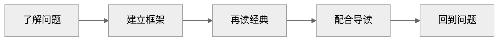

我时常在这扇门外徘徊，时而往里窥探，却从没鼓起勇气往前迈出一步, 我好奇却又恐惧。

我害怕的莫过于身体还在世俗之内，精神却已飘到世俗之外，我怕这巨大的内在鸿沟会把自己撕裂。

但是那些伟大的智者充满真诚,他们好像一直在邀请我。

或许我应该接受一次，哪怕只是出于尊敬，认真地去倾听一次。

```mermaid
---
config:
    theme: neutral
---
flowchart LR
了解问题 --> 建立框架
建立框架 --> 再读经典
再读经典 --> 配合导读
配合导读 --> 回到问题
```

我会沿着这个路径开始我的拜访，所以第一本书是通识类读物《大问题》，同时 AI...